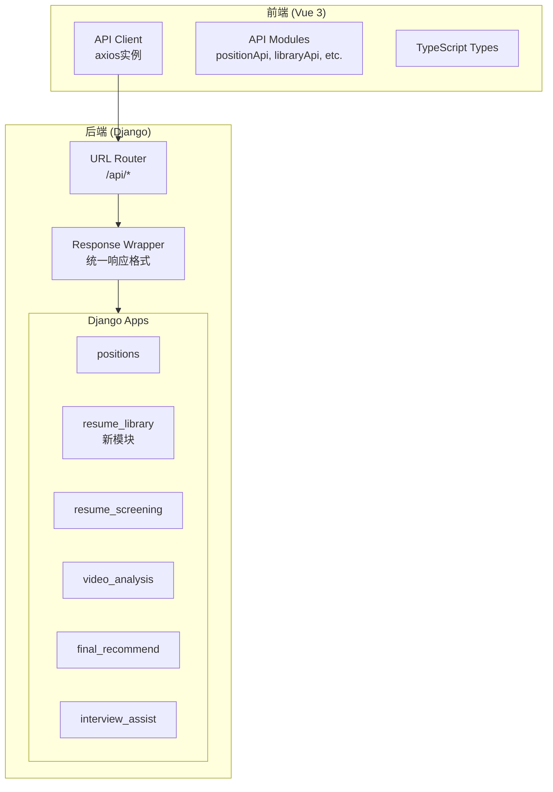

# Design Document: API Optimization

## Overview

本设计文档描述HRM2招聘系统前后端API优化的技术方案。优化目标是建立统一、规范、可维护的API架构，包括路径规范化、响应格式统一、模块解耦、命名规范化等方面。

### 设计目标

1. 所有API使用统一的 `/api/` 前缀
2. RESTful风格的资源路径设计
3. 统一的响应格式包装
4. 简历库与简历筛选模块解耦
5. 前后端字段命名一致
6. 完善的验证机制

## Architecture

### 当前架构问题

```
当前API路径结构:
/position-settings/          → 岗位设置
/position-settings/list/     → 冗余路径
/position-settings/positions/ → 冗余路径
/resume-screening/           → 简历筛选 + 简历库（耦合）
/video-analysis/             → 视频分析
/final-recommend/            → 最终推荐
/interview-assist/           → 面试辅助
```

### 目标架构

```
目标API路径结构:
/api/positions/              → 岗位管理
/api/library/                → 简历库（独立模块）
/api/screening/              → 简历筛选
/api/videos/                 → 视频分析
/api/recommend/              → 最终推荐
/api/interviews/             → 面试辅助
```

### 架构图



## Components and Interfaces

### 1. 后端URL路由重构

#### 1.1 主路由配置 (config/urls.py)

```python
urlpatterns = [
    path('admin/', admin.site.urls),
    
    # API文档
    path('api/schema/', SpectacularAPIView.as_view(), name='schema'),
    path('api/docs/', SpectacularSwaggerView.as_view(url_name='schema'), name='swagger-ui'),
    
    # API端点 - 统一 /api/ 前缀
    path('api/positions/', include('apps.position_settings.urls')),
    path('api/library/', include('apps.resume_library.urls')),  # 新模块
    path('api/screening/', include('apps.resume_screening.urls')),
    path('api/videos/', include('apps.video_analysis.urls')),
    path('api/recommend/', include('apps.final_recommend.urls')),
    path('api/interviews/', include('apps.interview_assist.urls')),
]
```

#### 1.2 岗位管理路由 (apps/position_settings/urls.py)

```python
# 目标路径: /api/positions/
urlpatterns = [
    path('', PositionListView.as_view(), name='list'),           # GET列表, POST创建
    path('<uuid:id>/', PositionDetailView.as_view(), name='detail'),  # GET/PUT/DELETE
    path('<uuid:id>/resumes/', PositionResumesView.as_view(), name='resumes'),  # 简历分配
    path('ai/generate/', PositionAIGenerateView.as_view(), name='ai-generate'),
]
```

#### 1.3 简历库路由 (apps/resume_library/urls.py) - 新模块

```python
# 目标路径: /api/library/
urlpatterns = [
    path('', LibraryListView.as_view(), name='list'),            # GET列表, POST上传
    path('<uuid:id>/', LibraryDetailView.as_view(), name='detail'),   # GET/PUT/DELETE
    path('batch-delete/', LibraryBatchDeleteView.as_view(), name='batch-delete'),
    path('check-hash/', LibraryCheckHashView.as_view(), name='check-hash'),
]
```

#### 1.4 简历筛选路由 (apps/resume_screening/urls.py)

```python
# 目标路径: /api/screening/
urlpatterns = [
    path('', ScreeningView.as_view(), name='submit'),            # POST提交筛选
    path('tasks/', TaskListView.as_view(), name='task-list'),    # GET任务历史
    path('tasks/<uuid:id>/', TaskDetailView.as_view(), name='task-detail'),  # GET/DELETE
    path('reports/<uuid:id>/', ReportView.as_view(), name='report'),  # GET报告
    path('groups/', GroupListView.as_view(), name='group-list'),
    path('groups/<uuid:id>/', GroupDetailView.as_view(), name='group-detail'),
    
    # 开发工具
    path('dev/generate-resumes/', DevGenerateResumesView.as_view(), name='dev-generate'),
]
```

### 2. 统一响应格式

#### 2.1 响应包装器 (apps/common/response.py)

```python
from rest_framework.response import Response

class ApiResponse:
    @staticmethod
    def success(data=None, message="success"):
        return Response({
            "code": 200,
            "message": message,
            "data": data
        })
    
    @staticmethod
    def error(code=400, message="error", data=None):
        return Response({
            "code": code,
            "message": message,
            "data": data
        }, status=code)
    
    @staticmethod
    def paginated(items, total, page, page_size, message="success"):
        return Response({
            "code": 200,
            "message": message,
            "data": {
                "items": items,
                "total": total,
                "page": page,
                "page_size": page_size
            }
        })
```

### 3. 前端API模块重构

#### 3.1 API配置 (src/api/config.ts)

```typescript
import axios from 'axios'

const API_BASE = import.meta.env.VITE_API_BASE ?? 'http://localhost:8000/api'

export const apiClient = axios.create({
  baseURL: API_BASE,
  timeout: 30000,
  headers: { 'Content-Type': 'application/json' }
})

// 响应拦截器 - 统一处理响应格式
apiClient.interceptors.response.use(
  (response) => {
    const { code, message, data } = response.data
    if (code !== 200) {
      return Promise.reject(new Error(message))
    }
    return data  // 直接返回data部分
  },
  (error) => {
    const message = error.response?.data?.message || error.message
    return Promise.reject(new Error(message))
  }
)
```

#### 3.2 API端点常量 (src/api/endpoints.ts)

```typescript
export const ENDPOINTS = {
  // 岗位管理
  POSITIONS: '/positions',
  POSITION_DETAIL: (id: string) => `/positions/${id}`,
  POSITION_RESUMES: (id: string) => `/positions/${id}/resumes`,
  POSITION_AI_GENERATE: '/positions/ai/generate',
  
  // 简历库
  LIBRARY: '/library',
  LIBRARY_DETAIL: (id: string) => `/library/${id}`,
  LIBRARY_BATCH_DELETE: '/library/batch-delete',
  LIBRARY_CHECK_HASH: '/library/check-hash',
  
  // 简历筛选
  SCREENING: '/screening',
  SCREENING_TASKS: '/screening/tasks',
  SCREENING_TASK_DETAIL: (id: string) => `/screening/tasks/${id}`,
  SCREENING_REPORT: (id: string) => `/screening/reports/${id}`,
  SCREENING_GROUPS: '/screening/groups',
  SCREENING_GROUP_DETAIL: (id: string) => `/screening/groups/${id}`,
  
  // 视频分析
  VIDEOS: '/videos',
  VIDEO_DETAIL: (id: string) => `/videos/${id}`,
  
  // 最终推荐
  RECOMMEND_ANALYSIS: (id: string) => `/recommend/analysis/${id}`,
  
  // 面试辅助
  INTERVIEW_SESSIONS: '/interviews/sessions',
  INTERVIEW_SESSION_DETAIL: (id: string) => `/interviews/sessions/${id}`,
  INTERVIEW_QUESTIONS: (id: string) => `/interviews/sessions/${id}/questions`,
  INTERVIEW_QA: (id: string) => `/interviews/sessions/${id}/qa`,
  INTERVIEW_REPORT: (id: string) => `/interviews/sessions/${id}/report`,
}
```

### 4. 模块解耦设计

#### 4.1 新建简历库模块 (apps/resume_library/)

```
apps/resume_library/
├── __init__.py
├── admin.py
├── apps.py
├── models.py          # 从resume_screening迁移ResumeLibrary模型
├── serializers.py
├── services.py        # 简历库业务逻辑
├── urls.py
├── views.py
└── migrations/
```

#### 4.2 模块间通信接口

```python
# apps/resume_library/services.py
class LibraryService:
    @staticmethod
    def get_resume_by_id(resume_id: str) -> Optional[ResumeLibrary]:
        """供其他模块获取简历内容"""
        pass
    
    @staticmethod
    def mark_as_screened(resume_id: str) -> bool:
        """标记简历已筛选"""
        pass

# apps/resume_screening/services/screening_service.py
from apps.resume_library.services import LibraryService

class ScreeningService:
    def process_screening(self, resume_ids: List[str]):
        for rid in resume_ids:
            resume = LibraryService.get_resume_by_id(rid)
            # 处理筛选逻辑
            LibraryService.mark_as_screened(rid)
```

## Data Models

### 字段命名统一化

| 当前字段 | 统一后字段 | 说明 |
|---------|-----------|------|
| `scores` | `screening_score` | 筛选评分 |
| `summary` | `screening_summary` | 筛选总结 |
| `task_id` | `task_id` | 保持不变 |
| `report_id` | `report_id` | 保持不变 |
| `position` | `position_title` | 岗位名称 |

### 前端类型定义更新

```typescript
// src/types/index.ts
export interface ResumeData {
  id: string
  position_title: string
  candidate_name: string
  resume_content?: string
  screening_score?: ScreeningScore  // 移除 scores 别名
  screening_summary?: string        // 移除 summary 别名
  report_md_url?: string
  created_at: string
}
```


## Correctness Properties

*A property is a characteristic or behavior that should hold true across all valid executions of a system-essentially, a formal statement about what the system should do. Properties serve as the bridge between human-readable specifications and machine-verifiable correctness guarantees.*

基于需求分析，以下是可通过属性测试验证的正确性属性：

### Property 1: API路径前缀一致性
*For any* 注册的API端点URL，该URL路径 SHALL 以 `/api/` 开头（排除admin和静态文件路径）。
**Validates: Requirements 1.1**

### Property 2: 无冗余路径
*For any* 两个不同的URL模式，如果它们指向同一个视图类，则它们 SHALL 具有不同的HTTP方法或不同的用途（如列表vs详情）。
**Validates: Requirements 1.4**

### Property 3: 成功响应格式一致性
*For any* 返回HTTP 2xx状态码的API响应，响应体 SHALL 包含 `code`、`message`、`data` 三个字段，且 `code` 等于200。
**Validates: Requirements 2.1**

### Property 4: 错误响应格式一致性
*For any* 返回HTTP 4xx或5xx状态码的API响应，响应体 SHALL 包含 `code`、`message`、`data` 三个字段，且 `code` 等于HTTP状态码。
**Validates: Requirements 2.2**

### Property 5: 分页响应格式一致性
*For any* 返回分页数据的API响应，`data` 字段 SHALL 包含 `items`、`total`、`page`、`page_size` 四个字段。
**Validates: Requirements 2.3**

### Property 6: OpenAPI Schema与实现一致性
*For any* 在OpenAPI schema中定义的端点，该端点 SHALL 在实际URL配置中存在且可访问。
**Validates: Requirements 5.1**

### Property 7: 视图类文档完整性
*For any* API视图类，该类 SHALL 具有非空的docstring描述。
**Validates: Requirements 5.2**

### Property 8: JSON字段命名规范
*For any* API响应中的JSON字段名，该字段名 SHALL 符合snake_case命名规范（小写字母和下划线）。
**Validates: Requirements 7.1**

### Property 9: 前后端字段一致性
*For any* 后端API返回的字段名，前端TypeScript接口中 SHALL 存在对应的同名字段定义。
**Validates: Requirements 7.2**

### Property 10: URL路径命名规范
*For any* API端点的URL路径段，该路径段 SHALL 符合kebab-case命名规范（小写字母和连字符）。
**Validates: Requirements 7.4**

### Property 11: 类命名规范
*For any* Django模型类或视图类，类名 SHALL 符合PascalCase命名规范。
**Validates: Requirements 7.5**

### Property 12: 前后端端点同步
*For any* 后端定义的API端点路径，前端端点配置中 SHALL 存在对应的路径定义。
**Validates: Requirements 8.1**

## Error Handling

### 后端错误处理

```python
# apps/common/exceptions.py
from rest_framework.views import exception_handler
from apps.common.response import ApiResponse

def custom_exception_handler(exc, context):
    response = exception_handler(exc, context)
    
    if response is not None:
        return ApiResponse.error(
            code=response.status_code,
            message=str(exc.detail) if hasattr(exc, 'detail') else str(exc),
            data=None
        )
    
    # 未处理的异常
    return ApiResponse.error(
        code=500,
        message="Internal server error",
        data=None
    )
```

### 前端错误处理

```typescript
// src/api/config.ts
apiClient.interceptors.response.use(
  (response) => {
    const { code, message, data } = response.data
    if (code !== 200) {
      // 业务错误
      ElMessage.error(message)
      return Promise.reject(new ApiError(code, message))
    }
    return data
  },
  (error) => {
    // 网络错误或服务器错误
    const message = error.response?.data?.message || '网络请求失败'
    ElMessage.error(message)
    return Promise.reject(new ApiError(error.response?.status || 500, message))
  }
)

class ApiError extends Error {
  constructor(public code: number, message: string) {
    super(message)
    this.name = 'ApiError'
  }
}
```

## Testing Strategy

### 双重测试方法

本项目采用单元测试和属性测试相结合的方式：
- **单元测试**: 验证具体示例和边界情况
- **属性测试**: 验证应在所有输入上成立的通用属性

### 属性测试框架

- **后端**: 使用 `hypothesis` 库进行Python属性测试
- **前端**: 使用 `fast-check` 库进行TypeScript属性测试

### 测试配置

每个属性测试配置运行至少100次迭代：

```python
# pytest.ini
[pytest]
hypothesis_settings = max_examples=100
```

```typescript
// vitest.config.ts
export default {
  test: {
    // fast-check默认运行100次
  }
}
```

### 测试标注格式

每个属性测试必须使用以下格式标注：

```python
# **Feature: api-optimization, Property 1: API路径前缀一致性**
def test_api_prefix_consistency():
    ...
```

```typescript
// **Feature: api-optimization, Property 3: 成功响应格式一致性**
it('should return consistent success response format', () => {
  ...
})
```

### 单元测试覆盖

1. **URL配置测试**: 验证所有端点可访问
2. **响应格式测试**: 验证各API的响应结构
3. **模块解耦测试**: 验证简历库和筛选模块独立性
4. **命名规范测试**: 验证字段和路径命名

### 集成测试

1. **前后端联调测试**: 验证API端点可从前端正确调用
2. **数据流测试**: 验证从简历上传到筛选的完整流程
