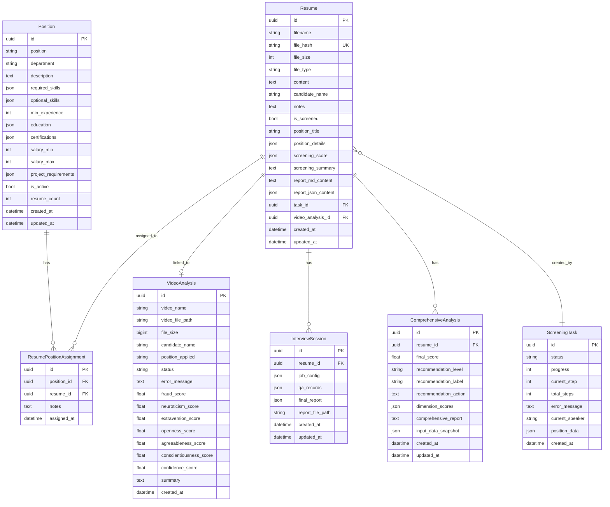

# 设计文档

## 概述

本设计文档描述了 FastAPI 后端迁移项目的技术架构和实现方案。新后端将完全替代现有的 Django 后端，同时保持与 Vue 前端的完全兼容。

### 设计目标

1. **API 完全兼容** - 保持所有 49 个 API 端点的 URL、请求参数和响应格式与 Django 后端一致
2. **现代化技术栈** - 使用 FastAPI + SQLAlchemy + Pydantic 构建高性能后端
3. **优化数据库设计** - 在保持功能完整的前提下，设计更合理的数据库结构
4. **独立部署** - 新项目独立于现有 Django 项目，可并行运行

## 架构

### 整体架构

```
HRM2-FastAPI-Backend/
├── app/
│   ├── __init__.py
│   ├── main.py                 # FastAPI 应用入口
│   ├── config.py               # 配置管理
│   ├── database.py             # 数据库连接
│   │
│   ├── models/                 # SQLAlchemy 数据模型
│   │   ├── __init__.py
│   │   ├── position.py         # 岗位模型
│   │   ├── resume.py           # 简历相关模型
│   │   ├── screening.py        # 筛选相关模型
│   │   ├── video.py            # 视频分析模型
│   │   ├── interview.py        # 面试辅助模型
│   │   └── recommend.py        # 推荐分析模型
│   │
│   ├── schemas/                # Pydantic 数据模式
│   │   ├── __init__.py
│   │   ├── common.py           # 通用响应格式
│   │   ├── position.py
│   │   ├── resume.py
│   │   ├── screening.py
│   │   ├── video.py
│   │   ├── interview.py
│   │   └── recommend.py
│   │
│   ├── api/                    # API 路由
│   │   ├── __init__.py
│   │   ├── deps.py             # 依赖注入
│   │   ├── positions.py        # /api/positions/
│   │   ├── library.py          # /api/library/
│   │   ├── screening.py        # /api/screening/
│   │   ├── videos.py           # /api/videos/
│   │   ├── recommend.py        # /api/recommend/
│   │   └── interviews.py       # /api/interviews/
│   │
│   ├── services/               # 业务逻辑层
│   │   ├── __init__.py
│   │   ├── position_service.py
│   │   ├── resume_service.py
│   │   ├── screening_service.py
│   │   ├── video_service.py
│   │   ├── interview_service.py
│   │   ├── recommend_service.py
│   │   └── ai_service.py       # AI 服务封装
│   │
│   └── utils/                  # 工具函数
│       ├── __init__.py
│       ├── response.py         # 统一响应格式
│       └── file_utils.py       # 文件处理
│
├── tests/                      # 测试目录
│   ├── __init__.py
│   ├── conftest.py
│   ├── test_api/
│   └── test_services/
│
├── alembic/                    # 数据库迁移
│   └── versions/
│
├── media/                      # 媒体文件存储
│   ├── screening_reports/
│   ├── interview_reports/
│   └── videos/
│
├── .env.example
├── requirements.txt
├── alembic.ini
└── README.md
```

### 技术栈

| 组件 | 技术选型 | 说明 |
|------|---------|------|
| Web 框架 | FastAPI 0.104+ | 高性能异步 Web 框架 |
| ORM | SQLAlchemy 2.0+ | 支持异步的 ORM |
| 数据验证 | Pydantic 2.0+ | 数据验证和序列化 |
| 数据库 | SQLite (默认) | 可切换 PostgreSQL/MySQL |
| 异步任务 | asyncio + BackgroundTasks | 轻量级异步任务 |
| API 文档 | Swagger UI | 自动生成 |
| 测试 | pytest + hypothesis | 单元测试 + 属性测试 |

## 组件和接口

### 1. 统一响应格式

所有 API 响应必须遵循以下格式：

```python
class ApiResponse(BaseModel):
    code: int           # 200/201/202 成功，其他为错误码
    message: str        # 响应消息
    data: Any = None    # 响应数据
```

### 2. API 路由模块

#### 2.1 岗位管理 (/api/positions/)

| 端点 | 方法 | 功能 |
|------|------|------|
| / | GET | 获取岗位列表 |
| / | POST | 创建岗位 |
| /{position_id}/ | GET | 获取岗位详情 |
| /{position_id}/ | PUT | 更新岗位 |
| /{position_id}/ | DELETE | 删除岗位 |
| /{position_id}/resumes/ | POST | 分配简历 |
| /{position_id}/resumes/{resume_id}/ | DELETE | 移除简历 |
| /ai/generate/ | POST | AI 生成岗位要求 |

#### 2.2 简历库 (/api/library/)

| 端点 | 方法 | 功能 |
|------|------|------|
| / | GET | 获取简历列表 |
| / | POST | 上传简历 |
| /{id}/ | GET | 获取简历详情 |
| /{id}/ | PUT | 更新简历 |
| /{id}/ | DELETE | 删除简历 |
| /batch-delete/ | POST | 批量删除 |
| /check-hash/ | POST | 检查哈希 |

#### 2.3 简历筛选 (/api/screening/)

| 端点 | 方法 | 功能 |
|------|------|------|
| / | POST | 提交筛选任务 |
| /tasks/ | GET | 任务列表 |
| /tasks/{task_id}/ | DELETE | 删除任务 |
| /tasks/{task_id}/status/ | GET | 任务状态 |
| /reports/{report_id}/ | GET | 报告详情 |
| /reports/{report_id}/download/ | GET | 下载报告 |
| /data/ | GET/POST | 简历数据 |
| /groups/ | GET | 简历组列表 |
| /groups/create/ | POST | 创建组 |
| /groups/{group_id}/ | GET | 组详情 |
| /groups/add-resume/ | POST | 添加简历到组 |
| /groups/remove-resume/ | POST | 从组移除简历 |
| /groups/set-status/ | POST | 设置组状态 |
| /videos/link/ | POST | 关联视频 |
| /videos/unlink/ | POST | 取消关联 |
| /dev/generate-resumes/ | POST | 生成测试简历 |
| /dev/force-error/ | GET/POST | 强制错误 |
| /dev/reset-state/ | POST | 重置状态 |

#### 2.4 视频分析 (/api/videos/)

| 端点 | 方法 | 功能 |
|------|------|------|
| / | GET | 视频列表 |
| /upload/ | POST | 上传视频 |
| /{video_id}/ | POST | 更新结果 |
| /{video_id}/status/ | GET | 分析状态 |

#### 2.5 最终推荐 (/api/recommend/)

| 端点 | 方法 | 功能 |
|------|------|------|
| /stats/ | GET | 统计数据 |
| /analysis/{resume_id}/ | GET | 获取分析 |
| /analysis/{resume_id}/ | POST | 执行分析 |

#### 2.6 面试辅助 (/api/interviews/)

| 端点 | 方法 | 功能 |
|------|------|------|
| /sessions/ | GET | 会话列表 |
| /sessions/ | POST | 创建会话 |
| /sessions/{session_id}/ | GET | 会话详情 |
| /sessions/{session_id}/ | DELETE | 删除会话 |
| /sessions/{session_id}/questions/ | POST | 生成问题 |
| /sessions/{session_id}/qa/ | POST | 记录问答 |
| /sessions/{session_id}/report/ | POST | 生成报告 |

## 数据模型

### 简化设计说明

相比 Django 原有的 10 张表，新设计简化为 7 张核心表：

| 简化项 | 原设计 | 新设计 | 原因 |
|--------|--------|--------|------|
| 简历存储 | ResumeLibrary + ResumeData | Resume (统一) | 合并原始简历和筛选数据 |
| 筛选报告 | ScreeningReport | 合并到 Resume | 报告内容直接存在简历记录中 |
| 简历分组 | ResumeGroup | 使用 Position | 岗位本身就是分组依据 |

### 数据库 ER 图



### 模型设计说明

1. **Position (岗位)** - 存储岗位招聘标准，同时作为简历分组依据
2. **Resume (简历)** - 统一的简历模型，包含：
   - 原始简历信息（filename, file_hash, content）
   - 筛选状态和结果（is_screened, screening_score, screening_summary）
   - 报告内容（report_md_content, report_json_content）
3. **ScreeningTask (筛选任务)** - 简历筛选任务，支持异步处理
4. **VideoAnalysis (视频分析)** - 面试视频分析结果
5. **InterviewSession (面试会话)** - 面试辅助会话，问答记录以 JSON 存储
6. **ComprehensiveAnalysis (综合分析)** - 候选人最终评估结果
7. **ResumePositionAssignment (简历岗位分配)** - 多对多关联表

### API 兼容性说明

虽然数据库简化了，但 API 层会保持完全兼容：

| 原 API | 数据来源 | 兼容方案 |
|--------|----------|----------|
| /api/library/ | ResumeLibrary | 查询 Resume 表，筛选 is_screened=false |
| /api/screening/data/ | ResumeData | 查询 Resume 表，筛选 is_screened=true |
| /api/screening/reports/{id}/ | ScreeningReport | 从 Resume 表读取 report_* 字段 |
| /api/screening/groups/ | ResumeGroup | 按 position_title 聚合 Resume |

## 正确性属性

*属性是一种应该在系统所有有效执行中保持为真的特征或行为——本质上是关于系统应该做什么的正式声明。属性作为人类可读规范和机器可验证正确性保证之间的桥梁。*

### Property 1: 统一响应格式

*对于任意* API 响应，响应体必须包含 code、message 和 data 三个字段，且 code 为整数类型

**验证: 需求 1.4**

### Property 2: 成功响应码范围

*对于任意* 成功的业务操作，响应的 code 值必须在 [200, 201, 202] 范围内

**验证: 需求 1.5**

### Property 3: 分页数据一致性

*对于任意* 分页查询请求，返回的 items 数组长度必须小于等于请求的 page_size，且 total 必须大于等于 items 长度

**验证: 需求 3.1**

### Property 4: 文件哈希去重

*对于任意* 已存在于简历库中的文件哈希值，check-hash 接口必须返回 exists[hash] = true

**验证: 需求 3.7**

### Property 5: 岗位创建后可查询

*对于任意* 成功创建的岗位，使用返回的 id 查询详情必须能获取到相同的岗位数据

**验证: 需求 2.2, 2.3**

### Property 6: 简历上传后可检索

*对于任意* 成功上传的简历，使用返回的 id 查询详情必须能获取到简历内容

**验证: 需求 3.2, 3.3**

### Property 7: 任务状态一致性

*对于任意* 筛选任务，其状态必须是 pending、running、completed、failed 之一

**验证: 需求 4.3**

### Property 8: 简历组成员计数

*对于任意* 简历组，其 resume_count 字段必须等于实际关联的简历数量

**验证: 需求 5.1**

### Property 9: 会话问答记录递增

*对于任意* 面试会话，每次记录问答后 current_round 必须递增 1

**验证: 需求 10.6**

### Property 10: UUID 格式一致性

*对于任意* 返回的资源 ID，必须是有效的 UUID 格式字符串

**验证: 需求 12.2**

## 错误处理

### 错误码定义

| 错误码 | 含义 | 使用场景 |
|--------|------|----------|
| 400 | 请求参数错误 | 参数验证失败 |
| 404 | 资源不存在 | 查询不存在的记录 |
| 409 | 资源冲突 | 重复创建、哈希冲突 |
| 422 | 数据验证失败 | Pydantic 验证错误 |
| 500 | 服务器内部错误 | 未预期的异常 |

### 错误响应格式

```python
{
    "code": 404,
    "message": "岗位不存在",
    "data": {
        "position_id": "xxx-xxx-xxx"
    }
}
```

## 测试策略

### 单元测试

- 使用 pytest 进行单元测试
- 测试覆盖所有 Service 层业务逻辑
- 使用 pytest-asyncio 测试异步代码

### 属性测试

- 使用 hypothesis 库进行属性测试
- 每个属性测试运行至少 100 次迭代
- 测试标注格式: `**Feature: fastapi-backend-migration, Property {number}: {property_text}**`

### 集成测试

- 使用 TestClient 测试 API 端点
- 使用内存 SQLite 数据库进行测试
- 测试完整的请求-响应流程

### 测试框架配置

```python
# pytest.ini
[pytest]
asyncio_mode = auto
testpaths = tests
python_files = test_*.py
python_functions = test_*

# hypothesis 配置
hypothesis.settings.default.max_examples = 100
```
